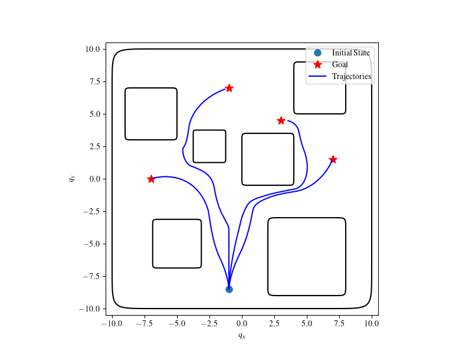

## Higher-Order Barrier Function Composition Library

This library provides a set of classes and utilities for working with barrier functions and higher-order barrier functions (HOCBFs) in the context of control systems and optimization problems.

This repository provides implementations of barrier functions and higher-order composition barrier functions for control and safety in dynamical systems. It includes classes for basic barrier functions, composition of barrier functions, soft composition, and non-smooth composition.

## Barrier Class

The `Barrier` class represents a basic barrier function with methods for assigning barrier functions, dynamics, and computing barrier values.

### Important Methods

- `assign(barrier_func, rel_deg=1, alphas=None)`: Assigns a barrier function to the Barrier object.
- `assign_dynamics(dynamics)`: Assigns dynamics to the Barrier object and generates higher-order barrier functions.
- `raise_rel_deg(x, raise_rel_deg_by=1, alphas=None)`: Raises the relative degree of the barrier function.
- `barrier(x)`: Computes the barrier function value at a given state.
- `hocbf(x)`: Computes the highest-order barrier function value at a given state.
- `Lf_hocbf(x)`: Computes the Lie derivative of the highest-order barrier function with respect to the system dynamics.
- `Lg_hocbf(x)`: Computes the Lie derivative of the highest-order barrier function with respect to the system dynamics.
- `compute_barriers_at(x)`: Computes barrier values at a given state.
- `get_min_barrier_at(x)`: Gets the minimum barrier value at a given state.

## CompositionBarrier Class

The `CompositionBarrier` class extends the `Barrier` class and represents a barrier formed by composing multiple barriers with a specific rule.

### Important Methods

- `assign_barriers_and_rule(barriers, rule)`: Assigns multiple barriers and a composition rule to the CompositionBarrier object.
- `min_barrier(x)`: Calculates the minimum value among all the barrier values computed at a point.
- `compose(c_key)`: Selects the appropriate composition rule based on the provided key.

## SoftCompositionBarrier Class

The `SoftCompositionBarrier` class extends the `CompositionBarrier` class and represents a soft composition of multiple barriers with specific soft composition rules.

## NonSmoothCompositionBarrier Class

The `NonSmoothCompositionBarrier` class extends the `CompositionBarrier` class and represents a non-smooth composition of multiple barriers with specific non-smooth composition rules.


### Usage Example

```python

# Create a Barrier object
barrier = Barrier().assign(barrier_func=h, rel_deg=2, alphas=[alpha1, alpha2])
barrier.assign_dynamics(dynamics)

# Compute the barrier function, HOCBF, and their Lie derivatives
barrier_value = barrier.barrier(x)
hocbf_value = barrier.hocbf(x)
Lf_hocbf = barrier.Lf_hocbf(x)
Lg_hocbf = barrier.Lg_hocbf(x)

# Create a CompositionBarrier object
barriers = [barrier1, barrier2, barrier3]
composition_barrier = SoftCompositionBarrier().assign_barriers_and_rule(barriers, 'union')

# Compute the composed barrier function and HOCBF
composed_barrier_value = composition_barrier.barrier(x)
composed_hocbf_value = composition_barrier.hocbf(x)
```

## Unicycle Example

The Unicycle example demonstrates the use of higher-order composition barrier functions for safe control of a unicycle robot navigating through obstacles to reach predefined goal locations.


Example code snippet:

```python
from hocbf_composition.examples.unicycle_dynamics import UnicycleDynamics
from hocbf_composition.make_map import Map

# Instantiate dynamics
dynamics = UnicycleDynamics(state_dim=4, action_dim=2)

# Define barrier function configurations and dynamics parameters and create a Map object
map = Map(barriers_info=barriers_info, dynamics=dynamics, cfg=cfg)

# Simulate the unicycle's trajectory
```

